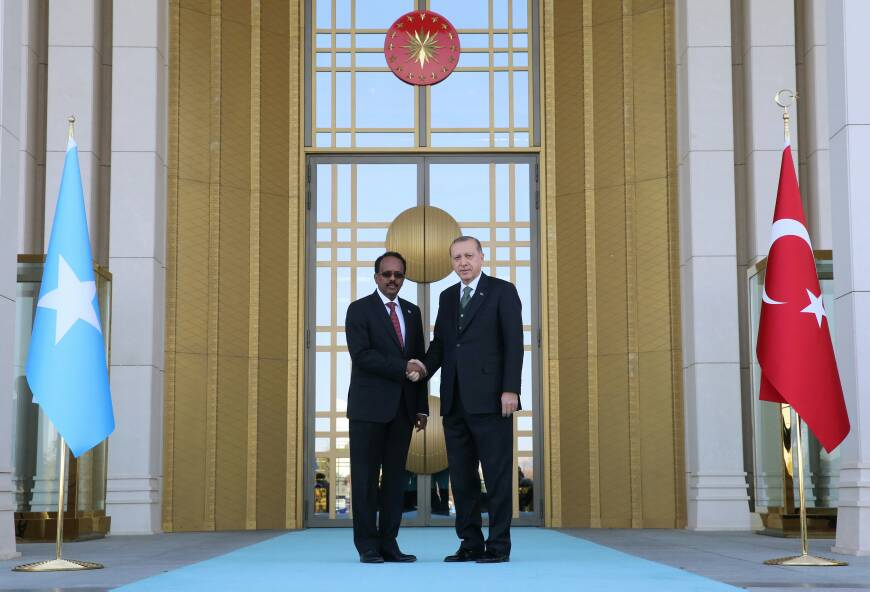
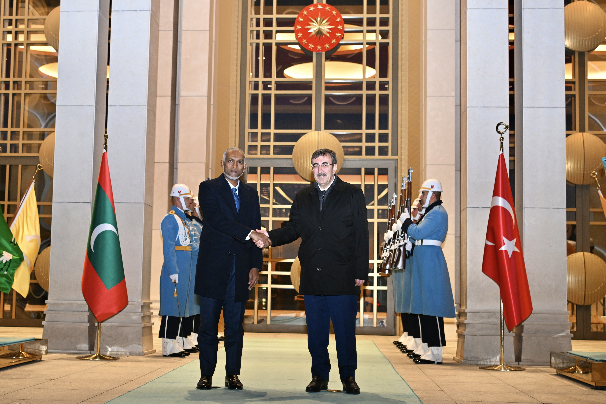

# Exercise 003 - OSInt

**Task briefing:** 

In April 2017 Mohamed Abdullahi Farmaajo, the then president of Somalia, visited Turkey. A news agency published a photo where he was seen shaking hands with Recep Tayyip Erdoğan, the country’s president. The article did not disclose where the photo was taken. Your task is to find out the name and coordinates of the location seen below.  

Click [here](./osint-exercise-003-picture.jpg) to see the photo on its own.

> ### Somalia President makes first international state visit to Turkey
> 
> By - April 27, 2017
> 
> 
> 
> Somali President Mohammed Abdullahi Farmajo accompanied by a high level delegation visited Turkey from Tuesday following an official invitation by the Turkish President.

## Solution

A quick search of the given image on Google Lens led me to the following image on the official website of [the President's Office of Maldives](https://presidencymaldives.gov.mv/Press/Article/29182).

The press release on the above website clearly mentions the location of the image taken to be the Presidential Complex in Ankara, Turkey.

> The Vice President of the Republic of Türkiye, H.E. Cevdet Yilmaz, paid a
>  courtesy call on H.E. President Dr Mohamed Muizzu on Monday. The 
> meeting was held at the Presidential Complex in Ankara.
> 
> — [The President's Office (Republic of Maldives)](https://presidencymaldives.gov.mv/Press/Article/29182)

Hence, we have the location of the challenge image to be the Presidential Complex of Turkey (Coordinates: 39°55′51″N 32°47′56″E).
