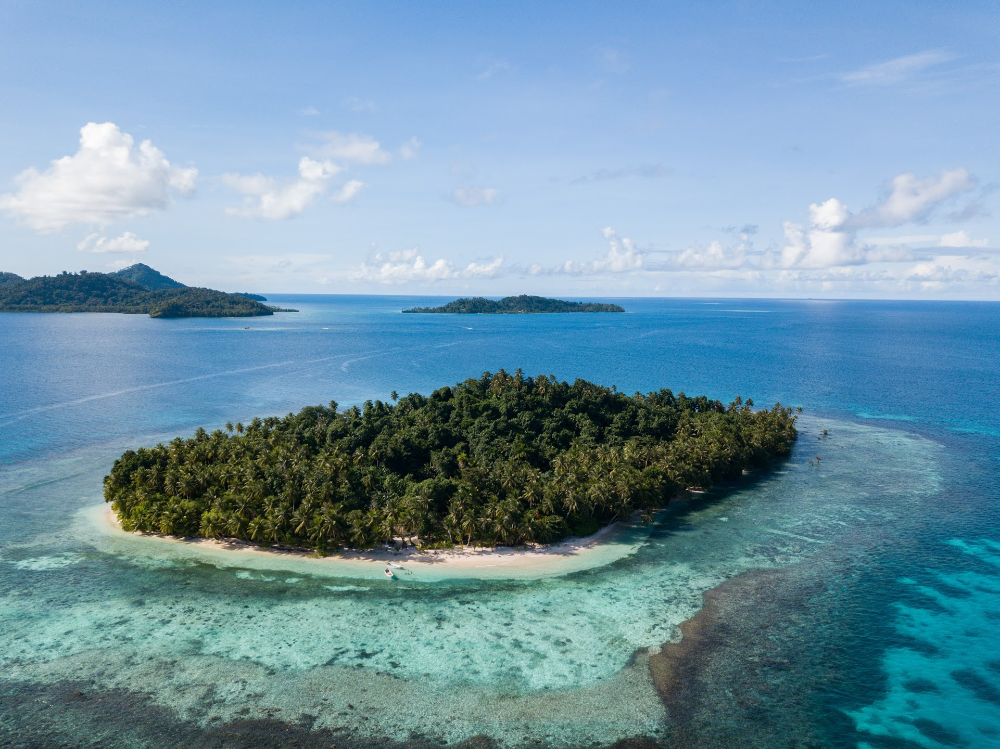

# Exercise 004 - OSInt

**Task briefing:**  

This is a photo of a resort located on an island.  

1. What is the name of the resort?  
2. What are the coordinates of the island?  
3. In which cardinal direction was the camera facing when the photo was taken?

Click [here](./osint-exercise-004-big-picture.jpg) to open the photo on a new tab.

## Solution

A quick exact search of the image on Google Lens gave multiple results indicating the island being Oan Resort. It's coordinates are 7.362791979953711 N, 151.75630806651873 E. Entering the exact coordinates on Google Earth and switching to 3D mode indicated that the camera faces the North-West direction.

#### Answers

1. Oan Resort

2. 7.362791979953711 N, 151.75630806651873 E

3. North-west
