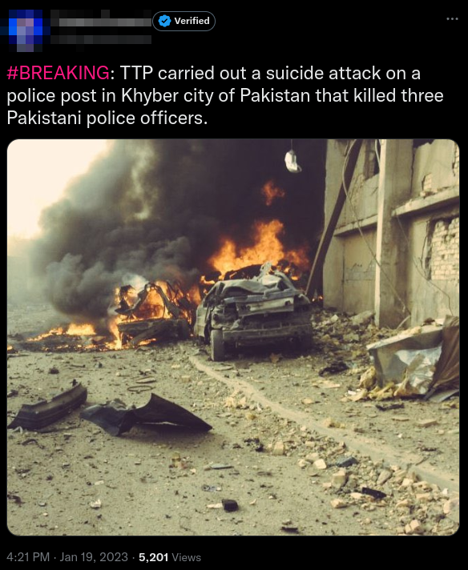

# Exercise 006 - OSInt

Challenge link [here](https://gralhix.com/list-of-osint-exercises/osint-exercise-006/)

## Task Briefing

On January 19, 2023, a journalist with almost 140k followers on 
Twitter shared an image of a destroyed vehicle amidst a large cloud of 
smoke and fire. The tweet said: “*BREAKING: TTP* *carried out a suicide attack on a police post in Khyber city of Pakistan that killed three Pakistani police officers.*“  

The photo is not of the event described by the journalist.
    a) Verify the statement above.

Click [here](./osintexercise006.webp) to open the photo on a new tab.

**Note: You do NOT need to find the author of the tweet seen below. Do NOT harass the journalist.**

## Solution

**Note: Google was the only search engine used for this solve.**

I tried Googling "TTP terrorists Khyber bombing" and after viewing and analysing multiple newsfeeds, I verified that the image was infact inaccurate with what happened.

Next, I uploaded just the image and not the tweet onto Google lens and checked for 'Exact matches'. An attack in Baghdad, Iraq kept coming up. Multiple sources confirmed that this attack occured in the Waziriyia district of Baghdad, Iraq.

Sources:

1. https://garystockbridge617.getarchive.net/amp/media/a-vehicle-born-improvised-explosive-devise-vbied-after-exploding-on-a-street-5302d5

2. [One civilian killed, two injured in bomb blast north of Baghdad - Shia Waves](https://shiawaves.com/english/news/islam/5428-one-civilian-killed-two-injured-in-bomb-blast-north-of-baghdad/)

3. [File:WaziriyaAutobombeIrak.jpg - Wikipedia](https://en.m.wikipedia.org/wiki/File:WaziriyaAutobombeIrak.jpg#filehistory)

Hence, it is verified that the photo does not correspond with the event mentioned by the journalist.
