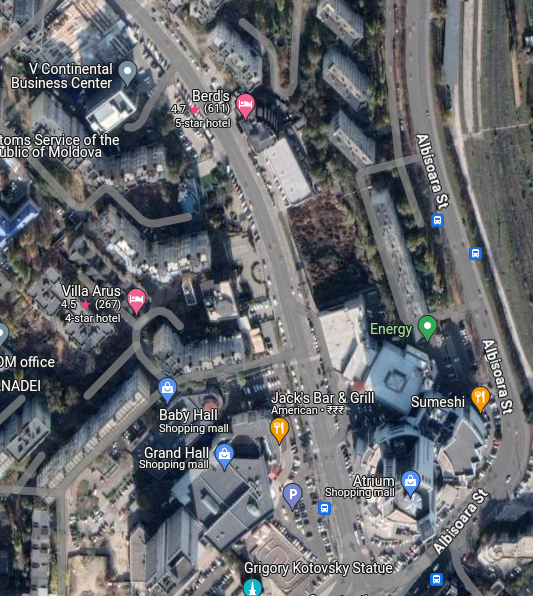

# Exercise 014 - OSInt

**Task briefing:**  

The video below was recorded during an earthquake. Please find the answer to the following questions:

1. What was the magnitude of this earthquake?  
2. What are the coordinates of where the camera was likely located in order to record this scene?  

Click [here](https://youtu.be/myTG1LpMN7g) to open the video in a new window.

<body>
<iframe height="450" width="800" 
            src="https://www.youtube.com/embed/myTG1LpMN7g"> 
      </iframe>
</body>

## Solution

On Googling "24-Sep-2016 earthquake", I was immediately given the magnitude of the earthquake. It was revealed to be 5.6 and the epicentre was in Romania. A quick search on Google Lens using screenshots from the video led me to the following YouTube video.

<body>
<iframe height="450" width="800" 
            src="https://www.youtube.com/embed/lvGpouFqmJ0"> 
      </iframe>
</body>

This concludes that the camera is situated in Chisinau, Moldova. Next I went on Google Earth and searched for any parking lots near commercial centres and I found a matching location from the satellite view. The camera was revealed to be located at V Continental Business Centre (47°01'02.5"N 28°51'10.3"E). Following is the satellite view of the matching location...

