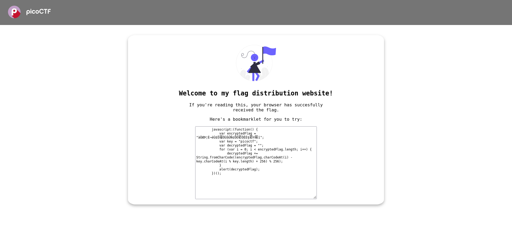
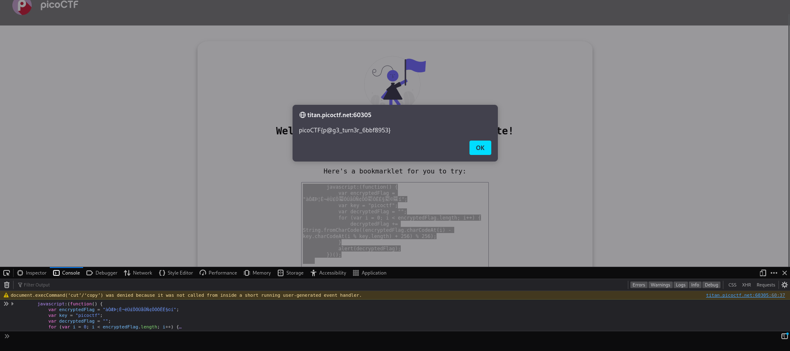

# Bookmarklet - Web

## Description

Why search for the flag when I can make a bookmarklet to print it for me? Browse [here](), and find the flag!

#### Hints:

- A bookmarklet is a bookmark that runs JavaScript instead of loading a webpage.

- What happens when you click a bookmarklet?

- Web browsers have other ways to run JavaScript too.

## Solution

We are given a link to a webpage which looks like the following...



The page contains a JavaScript function. There doesn't seem to be anything suspicious about it so I run the function in the browser's console and it reveals the flag.

```javascript
    javascript:(function() {
        var encryptedFlag = "àÒÆަȬë٣֖ÓÚåÛÑ¢ÕӜÒËɧœ©™í";
        var key = "picoctf";
        var decryptedFlag = "";
        for (var i = 0; i < encryptedFlag.length; i++) {
            decryptedFlag += String.fromCharCode((encryptedFlag.charCodeAt(i) - key.charCodeAt(i % key.length) + 256) % 256);
        }
        alert(decryptedFlag);
    })();
    
```


