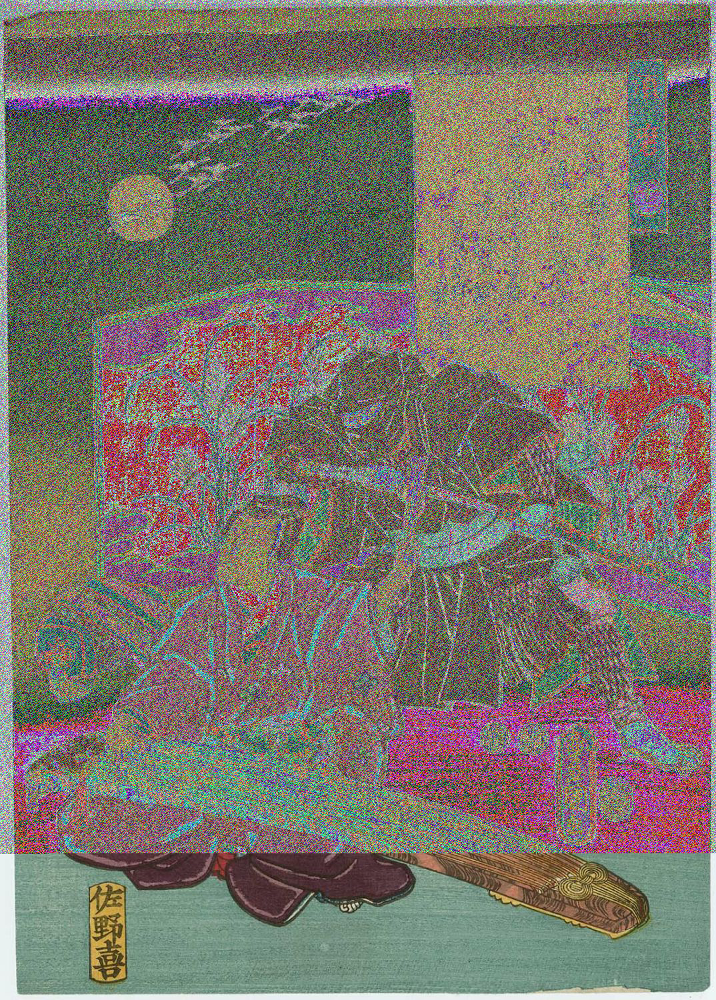

# MSB - Forensics

## Description

This image passes LSB statistical analysis, but we can't help but think there must be something to the visual artifacts present in this image... 

Download the image [here](https://artifacts.picoctf.net/c/306/Ninja-and-Prince-Genji-Ukiyoe-Utagawa-Kunisada.flag.png)

#### Hints:

- What's causing the 'corruption' of the image?

#### Attachments: [`Ninja-and-Prince-Genji-Ukiyoe-Utagawa-Kunisada.flag.png`](./Ninja-and-Prince-Genji-Ukiyoe-Utagawa-Kunisada.flag.png)

## Solution

We are given an image file [`Ninja-and-Prince-Genji-Ukiyoe-Utagawa-Kunisada.flag.png`](./Ninja-and-Prince-Genji-Ukiyoe-Utagawa-Kunisada.flag.png). It looks like the following...



The image seems to have a lot of corrupt pixels. The `file` command and `binwalk` command say it is a normal PNG file.

```bash
$ file Ninja-and-Prince-Genji-Ukiyoe-Utagawa-Kunisada.flag.png 
Ninja-and-Prince-Genji-Ukiyoe-Utagawa-Kunisada.flag.png: PNG image data, 1074 x 1500, 8-bit/color RGB, non-interlaced

$ binwalk Ninja-and-Prince-Genji-Ukiyoe-Utagawa-Kunisada.flag.png 

DECIMAL       HEXADECIMAL     DESCRIPTION
--------------------------------------------------------------------------------
0             0x0             PNG image, 1074 x 1500, 8-bit/color RGB, non-interlaced
41            0x29            Zlib compressed data, default compression
```

After reading up on LSB steganography, I thought the data might be hidden in the corrupt pixels. But in LSB steganography, usually the image doesn't appear distorted as the data is hidden in the least significant bit. However, here the image is highly distorted and the name of the challenge is MSB, I came to the conclusion that the data must be hidden in the most significant bit. I wrote a script [`solve.py`](./solve.py) that extracts this data and filters out the flag.

```bash
$ python3 solve.py
picoCTF{15_y0ur_que57_qu1x071c_0r_h3r01c_06326238}
```

Hence the flag is `$ picoCTF{15_y0ur_que57_qu1x071c_0r_h3r01c_06326238}`.
