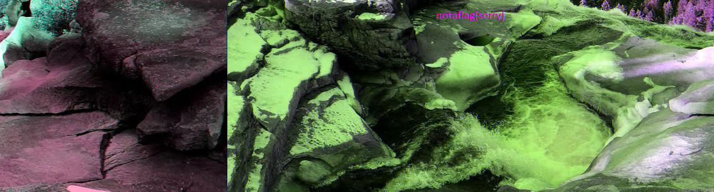

# tunn3l v1s10n - Forensics

## Description

We found this [file](./tunn3l_v1s10n). Recover the flag.

#### Hints:

- Weird that it won't display right...

#### Attachments: [`tunn3l_v1s10n`](./tunn3l_v1s10n)

## Solution

We are given an unknown file [`tunn3l_v1s10n`](./tunn3l_v1s10n). Using neovim to view the file's contents produced gibberish. I tried the `file` command to view what kind of file we are given.

```bash
$ file tunn3l_v1s10n 
tunn3l_v1s10n: data
```

This did not narrow it down. I checked the file signature using `hexedit` to see if it contains any known file signature. 

```
00000000   42 4D 8E 26  2C 00 00 00  00 00 BA D0  00 00 BA D0  BM.&,...........
00000010   00 00 6E 04  00 00 32 01  00 00 01 00  18 00 00 00  ..n...2.........
00000020   00 00 58 26  2C 00 25 16  00 00 25 16  00 00 00 00  ..X&,.%...%.....
00000030   00 00 00 00  00 00 23 1A  17 27 1E 1B  29 20 1D 2A  ......#..'..) .*
00000040   21 1E 26 1D  1A 31 28 25  35 2C 29 33  2A 27 38 2F  !.&..1(%5,)3*'8/
00000050   2C 2F 26 23  33 2A 26 2D  24 20 3B 32  2E 32 29 25  ,/&#3*&-$ ;2.2)%
00000060   30 27 23 33  2A 26 38 2C  28 36 2B 27  39 2D 2B 2F  0'#3*&8,(6+'9-+/
00000070   26 23 1D 12  0E 23 17 11  29 16 0E 55  3D 31 97 76  &#...#..)..U=1.v
00000080   66 8B 66 52  99 6D 56 9E  70 58 9E 6F  54 9C 6F 54  f.fR.mV.pX.oT.oT
00000090   AB 7E 63 BA  8C 6D BD 8A  69 C8 97 71  C1 93 71 C1  .~c..m..i..q..q.
```

`42 4D` does correspond to a BMP file signature. I tried to open it with an image viewer but it gave me an error that 'BMP image has unsupported header size'. I read on [Wikipedia](https://en.wikipedia.org/wiki/BMP_file_format) that header size is specified as 4 bytes in an offset of 14 bytes. I downloaded a random bmp file [`sample.bmp`](./sample.bmphe 4 bytes at) and copied to the above position to the given challenge file, hence producing [`tunn3l_v1s10n_1`](./tunn3l_v1s10n_1). Now I could view the image given below...



The hex content came out to be..

```
00000000   42 4D 8E 26  2C 00 00 00  00 00 BA D0  00 00 7C 00  BM.&,.........|.
00000010   00 00 6E 04  00 00 32 01  00 00 01 00  18 00 00 00  ..n...2.........
00000020   00 00 58 26  2C 00 25 16  00 00 25 16  00 00 00 00  ..X&,.%...%.....
00000030   00 00 00 00  00 00 23 1A  17 27 1E 1B  29 20 1D 2A  ......#..'..) .*
00000040   21 1E 26 1D  1A 31 28 25  35 2C 29 33  2A 27 38 2F  !.&..1(%5,)3*'8/
00000050   2C 2F 26 23  33 2A 26 2D  24 20 3B 32  2E 32 29 25  ,/&#3*&-$ ;2.2)%
00000060   30 27 23 33  2A 26 38 2C  28 36 2B 27  39 2D 2B 2F  0'#3*&8,(6+'9-+/
00000070   26 23 1D 12  0E 23 17 11  29 16 0E 55  3D 31 97 76  &#...#..)..U=1.v
00000080   66 8B 66 52  99 6D 56 9E  70 58 9E 6F  54 9C 6F 54  f.fR.mV.pX.oT.oT
00000090   AB 7E 63 BA  8C 6D BD 8A  69 C8 97 71  C1 93 71 C1  .~c..m..i..q..q.
```

It seems to be an incomplete image with a fake flag. Maybe the rest of the flag must be hidden in the rest of the image. I tried manipulating the image into 1:1 size because it seems like the image was cropped from above. The width is specified at offset of 12 bytes with a size of 4 bytes while height is at offset of 16 bytes with size 4 bytes. This means `6E 04` is the width while `32 01` gives the height. I changed the height to `6E 04` hence producing [`tunn3l_v1s10n_2`](./tunn3l_v1s10n_2).

Its hex content is now...

```
00000000   42 4D 8E 26  2C 00 00 00  00 00 BA D0  00 00 7C 00  BM.&,.........|.
00000010   00 00 6E 04  00 00 6E 04  00 00 01 00  18 00 00 00  ..n...n.........
00000020   00 00 58 26  2C 00 25 16  00 00 25 16  00 00 00 00  ..X&,.%...%.....
00000030   00 00 00 00  00 00 23 1A  17 27 1E 1B  29 20 1D 2A  ......#..'..) .*
00000040   21 1E 26 1D  1A 31 28 25  35 2C 29 33  2A 27 38 2F  !.&..1(%5,)3*'8/
00000050   2C 2F 26 23  33 2A 26 2D  24 20 3B 32  2E 32 29 25  ,/&#3*&-$ ;2.2)%
00000060   30 27 23 33  2A 26 38 2C  28 36 2B 27  39 2D 2B 2F  0'#3*&8,(6+'9-+/
00000070   26 23 1D 12  0E 23 17 11  29 16 0E 55  3D 31 97 76  &#...#..)..U=1.v
00000080   66 8B 66 52  99 6D 56 9E  70 58 9E 6F  54 9C 6F 54  f.fR.mV.pX.oT.oT
00000090   AB 7E 63 BA  8C 6D BD 8A  69 C8 97 71  C1 93 71 C1  .~c..m..i..q..q.
```

The image is as below...


Finally we have flag `picoCTF{qu1t3_a_v13w_2020}`
