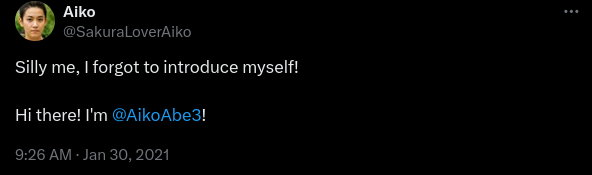

# Reconnaissance

## Description

### Background

It appears that our attacker made a fatal mistake in their operational security. They seem to have reused their username across other social media platforms as well. This should make it far easier for us to gather additional information on them by locating their other social media accounts.

### Instructions

Most digital platforms have some sort of username field. Many people become attached to their usernames, and may therefore use it across a number of platforms, making it easy to find other accounts owned by the same person when the username is unique enough. This can be especially helpful on platforms such as on job hunting sites where a user is more likely to provide real information about themselves, such as their full name or location information.

A quick search on a reputable search engine can help find matching usernames on other platforms, and there are also a large number of specialty tools that exist for that very same purpose. Keep in mind, that sometimes a platform will not show up in either the search engine results or in the specialized username searches due to false negatives. In some cases you need to manually check the site yourself to be 100% positive if the account exists or not. In order to answer the following questions, use the attacker's username found in Task 2 to expand the OSINT investigation onto other platforms in order to gather additional identifying information on the attacker. Be wary of any false positives!

#### Answer the questions below

1. What is the full email address used by the attacker?

2. What is the attacker's full real name?

## Solution

Username found from previous challenge: `SakuraSnowAngelAiko`

On googling SakuraSnowAngelAiko, I found a GitHub profile at [sakurasnowangelaiko (Aiko) · GitHub](https://github.com/sakurasnowangelaiko)

The profile hosted a repository named "PGP" which looked useful as it contained a PGP public key file [publickey](./publickey). I tried to decrypt the base64 contents of the file and found the email address used by the attacker. [`emailsolve.py`](./emailsolve.py) is the python script to decode base64 content.

```bash
$ py emailsolve.py
`

 h\^B5|f70
<8 A1X7+gp7e0Ey_&B3ie\`=(GYK:*a[/1H=\4QirsCY,|V(HS`2R3!#FBk:Z0V%H;f)!Y'D8Zu3[15}4wj9:n~txrzvs1+5m/rcah}Pdl(HWf[8[Nf81H/FVmF)2Mx\+NG'u.W6E~;.;h`V[6x'sA( SakuraSnowAngel83@protonmail.com
>!Q';&P`


        P
]BX^r,^^z%*Y-F,CBF9Z#(spC88m}zPKRA_.49hQSV'[L;BVo
                                                 QWr|1^Dc\E`^T\5w0OETc%d<M@qJJc*XLDoC$,xax.qJyX":Sf}9
gtOP;^c*&,H3yvMy`

                 &+#D<p4R}xY)NVfG       n$}]Hs$v`/,@aB1zF]aG:1F3S!\lwrQ&)#/%vYeBNw*$rmXHcH1/-w{@_&(;WCmo'w\:DF1>R&vt9tcuTL"u-F#Uq,wmGa}o#)8~_[@D1v$[8mez[lkp2.:K=A
                                                                     U5)8Uz6hUbDCf(W2R
&!Q';&P`


        PB
$SH!vWv%L $RS"-+S2h)rj&U[F%)jTr
z+84--+xko
6V{.NzoU
        tH?pRsY 5uFf-~n)wv|pgH^D.8/jz-GQoP7>]9k
#1+*y^lRW_g^1'Dvd@c%>mImjwbivO#u+^      zQ\Xc)
```

Hence the email is found to be `SakuraSnowAngel83@protonmail.com` from among the decoded content.

Also on googling SakuraSnowAngelAiko, I found a profile on X (formerly Twitter) with the username [@SakuraLoverAiko](https://x.com/sakuraloveraiko). This account had posted a post on 30 January 2021 revealing the attacker's true name as the following...



Hence the attacker's true name is `Aiko Abe`.

#### Answer

1. `SakuraSnowAngel83@protonmail.com`
2. `Aiko Abe`
