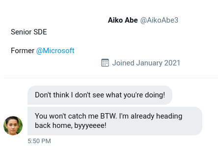

# Taunt

## Description

### Background

Just as we thought, the cybercriminal is fully aware that we are gathering information about them after their attack. They were even so brazen as to message the OSINT Dojo on Twitter and taunt us for our efforts. The Twitter account which they used appears to use a different username than what we were previously tracking, maybe there is some additional information we can locate to get an idea of where they are heading to next?

We've taken a screenshot of the message sent to us by the attacker, you can view it in your browser [here](https://raw.githubusercontent.com/OsintDojo/public/main/taunt.png).

### Instructions

Although many users share their username across different platforms, it isn't uncommon for users to also have alternative accounts that they keep entirely separate, such as for investigations, trolling, or just as a way to separate their personal and public lives. These alternative accounts might contain information not seen in their other accounts, and should also be investigated thoroughly. In order to answer the following questions, you will need to view the screenshot of the message sent by the attacker to the OSINT Dojo on Twitter and use it to locate additional information on the attacker's Twitter account. You will then need to follow the leads from the Twitter account to the Dark Web and other platforms in order to discover additional information.

#### Answer the questions below

1. What is the attacker's current Twitter handle?

2. What is the URL for the location where the attacker saved their WiFi  SSIDs and passwords?

3. What is the BSSID for the attacker's Home WiFi

## Solution

We are given an image file [`taunt.png`](./taunt.png). It looks like the following...

As it turns out, I was tracking the exact alternate Twitter account that sent the given taunt message ([@SakuraLoverAiko](https://x.com/sakuraloveraiko)) after all.

#### Answers

1. `SakuraLoverAiko`

#### Note: This much is all I could solve as my Internet Service Provider blocks the Dark Web. Even with VPN, I decided not to visit it since I have never visited it before.