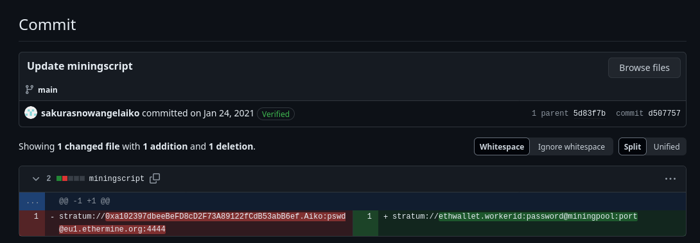
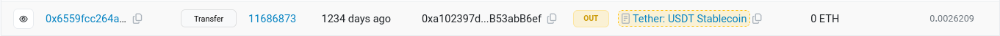
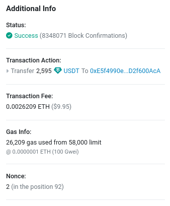

# Unveil

## Description

### Background

It seems the cybercriminal is aware that we are on to them. As we were investigating into their Github account we observed indicators that the account owner had already begun editing and deleting information in order to throw us off their trail. It is likely that they were removing this information because it contained some sort of data that would add to our investigation. Perhaps there is a way to retrieve the original information that they provided?

### Instructions

On some platforms, the edited or removed content may be unrecoverable unless the page was cached or archived on another platform. However, other platforms may possess built-in functionality to view the history of edits, deletions, or insertions. When available this audit history allows investigators to locate information that was once included, possibly by mistake or oversight, and then removed by the user. Such content is often quite valuable in the course of an investigation. In order to answer the below questions, you will need to perform a deeper dive into the attacker's Github account for any additional information that may have been altered or removed. You will then utilize this information to trace some of the attacker's cryptocurrency transactions.

#### Answer the questions below

1. What cryptocurrency does the attacker own a cryptocurrency wallet for?

2. What is the attacker's cryptocurrency wallet address?

3. What mining pool did the attacker receive payments from on January 23, 2021 UTC?

4. What other cryptocurrency did the attacker exchange with using their cryptocurrency wallet?

## Solution

The GitHub profile ([link](https://github.com/sakurasnowangelaiko)) found in the previous challenge hosted another repository useful to this challenge called 'ETH'. With this information it is confirmed that the attacker owns an Etherium wallet. 

On analysing the latest commit 'Update miningscript' in the only file [`miningscript`](https://github.com/sakurasnowangelaiko/ETH/blob/main/miningscript), we have the answers to the attacker's wallet address as well as the mining pool from which the attacker received payments from.

All transaction history is also available on [etherscan.io](https://etherscan.io/address/0xa102397dbeeBeFD8cD2F73A89122fCdB53abB6ef) after entering the wallet address. The other cryptocurrency `Tether` was found after viewing the entire transaction history of the given wallet. There were multiple 'OUT' transactions to the public tag "Tether: USDT StableCoin". The transaction value was 0 ETH on each of them but a finite value of USDT.

#### Answers

1. `Etherium`

2. `0xa102397dbeeBeFD8cD2F73A89122fCdB53abB6ef`

3. `Ethermine`

4. `Tether`
